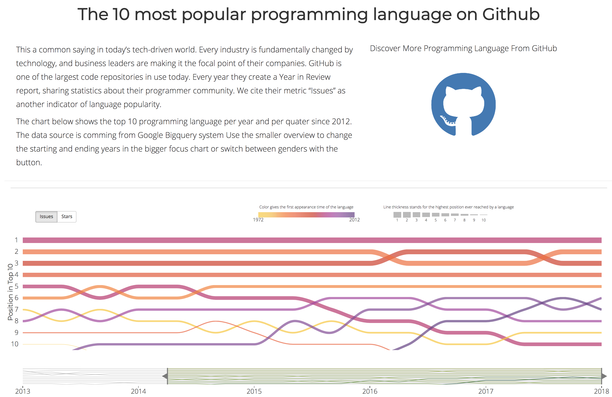

# CS3300-project2
This project shows the popularity trend of language programming by an interactive data visualization

Team: 
Chen Li 
XiaoXi Zhang 
SiChen Liu 
 ##  Design and Story

 

 Learning how to code has been “the trend” for younger generation during the past decade. Schools started to introduce coding technics earlier and earlier each year. What’s more, working professionals in varieties of industries had expressed interests and increased needs in learning basic coding logics as well. At the same time, Github is currently the largest online code repository. We believe by tracking “Issues” and “Stars” per language, we can not only get a good overview of how popular they were, but to understand each language’s characteristics.

 ##  Project Report
 [Report](report.pdf)
